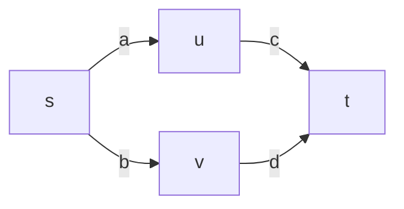

# Semirings

A Python library of semirings for dynamic programming.

Semirings are a powerful abstraction that enable a clean separation of concerns:

1. Devise a compact encoding of a set of derivations (e.g., paths in a graph,
   parses of a sentence).
2. Choose how to evaluate and aggregate them (e.g., the highest-weight
   derivation, the total weight, the set of all paths as a regular language).

By swapping the semiring, the *same* algorithm computes something entirely
different—and this library gives you a rich collection of semirings to swap
in.

## Installation

```bash
pip install git+https://github.com/timvieira/semirings
```

## Example: One Algorithm, Many Answers

Consider a diamond-shaped graph with four nodes and weighted edges:



There are two paths from `s` to `t`: one through `u` (edges `a`, `c`) and one
through `v` (edges `b`, `d`). We can use Kleene's algorithm to compute the
"total value" of all paths between every pair of nodes. The algorithm is always
the same—only the semiring changes, and with it, the question being answered.

```python
from semirings import Float, MinPlus, MaxPlus, MaxTimes, Boolean
from semirings.kleene import kleene
import numpy as np

def solve(S, weights):
    """Build the adjacency matrix and compute its Kleene star."""
    #          s       u       v       t
    A = np.array([
        [S.zero, weights['a'], weights['b'], S.zero],  # s
        [S.zero, S.zero,       S.zero,       weights['c']],  # u
        [S.zero, S.zero,       S.zero,       weights['d']],  # v
        [S.zero, S.zero,       S.zero,       S.zero],  # t
    ], dtype=object)
    star = kleene(A, S)
    return star[0, 3]   # s -> t entry

# Float: total weight of all paths (3*1 + 1*4 = 7)
solve(Float, dict(a=3.0, b=1.0, c=1.0, d=4.0))
# => 7.0

# MinPlus: shortest path (min(3+1, 1+4) = 4)
solve(MinPlus, dict(a=MinPlus(3), b=MinPlus(1), c=MinPlus(1), d=MinPlus(4)))
# => MinPlus(4)

# MaxPlus: longest path (max(3+1, 1+4) = 5)
solve(MaxPlus, dict(a=MaxPlus(3), b=MaxPlus(1), c=MaxPlus(1), d=MaxPlus(4)))
# => MaxPlus(5)

# MaxTimes (Viterbi): most probable path (max(0.5*0.3, 0.4*0.8) = 0.32)
solve(MaxTimes, dict(a=MaxTimes(0.5), b=MaxTimes(0.4),
                     c=MaxTimes(0.3), d=MaxTimes(0.8)))
# => MaxTimes(0.32)

# Boolean: is t reachable from s?
solve(Boolean, dict(a=Boolean(True), b=Boolean(True),
                    c=Boolean(True), d=Boolean(True)))
# => Boolean(True)
```

## Semiring Compendium

### Optimization

- **`MinPlus`** (tropical): `+` is min, `*` is addition. Shortest path / cheapest
  derivation.

- **`MaxPlus`** (arctic): `+` is max, `*` is addition. Longest path /
  highest-weight derivation.

- **`MaxTimes`** (Viterbi): `+` is max, `*` is multiplication. Most probable
  explanation in a probabilistic model.  Augment with backpointers to recover
  argmax.

- **`MinTimes`**: `+` is min, `*` is multiplication. Least probable derivation.

- **Bottleneck** (`semirings.misc`): `+` is max, `*` is min. Maximum-capacity
  path in a network.

- **`LazySort`** (K-best): Lazily enumerates the K-best derivations in sorted
  order without fixing K in advance. Uses lazy sorted merge and sorted product
  over streams.

- **`ConvexHull`** (MERT): `+` is convex hull union, `*` is Minkowski sum.
  Finds the set of optimal derivations under all linear weightings of
  objectives—used in minimum error rate training for machine translation.

### Arithmetic & Probabilities

- **`Float`**: Ordinary real arithmetic. Counts paths, computes total weight.
  Kleene star is `1/(1-x)`.

- **`LogVal`**: Numerically stable log-space arithmetic—isomorphic to the
  nonnegative reals, but avoids underflow by storing log-magnitudes and sign
  bits. Indispensable for probabilistic models.

- **Dual numbers** (`semirings.misc`): Forward-mode automatic differentiation.
  Computes function value and derivative simultaneously.

### Logic

- **`Boolean`**: `+` is OR, `*` is AND. Tests reachability and provability.

- **Lukasiewicz** (`semirings.misc`): `+` is max, `*` is max(0, x+y-1). A
  semiring for fuzzy / many-valued logic.

- **Three-valued logic** (`semirings.misc`): Values are {true, false, unknown}.
  `+` is max, `*` is min. Useful when some facts are uncertain.

### Provenance

Provenance semirings track *why* a query result holds in a database.

- **Why** (`semirings.misc`): Values are sets of annotation products. Captures
  which combinations of base facts are needed for a derived fact.

- **Lineage** (`semirings.misc`): Values are sets of reachable annotations—tracks which base facts contribute, without distinguishing how they combine.

### Formal Languages

- **`Symbol`** (regular languages): `+` is regex union, `*` is concatenation.
  Values are regular expressions / finite-state automata. The semiring of
  formal languages can enumerate the set of strings accepted by a grammar or
  automaton.

### Graph Structure

- **Bridge / VBridge** (`semirings.misc`): Detects edge bridges and vertex
  bridges (articulation points) in graphs via semiring computation.

- **`CutSets`**: `+` is set union, `*` is set intersection over minimal sets.
  Enumerates cut sets in a graph.

### Matrices

- **`MatrixSemiring(S, domain)`** (`semirings.kleene`): Given any semiring `S`
  and a finite domain, constructs the semiring of square matrices over `S`.
  Addition is element-wise, multiplication is matrix product, and Kleene star is
  computed via Kleene's algorithm. The domain can be any collection of hashable
  elements (strings, integers, etc.).

### Other

- **`Interval`**: Interval arithmetic (note: sub-distributive, so not a true
  semiring, but useful in practice).

- **Division** (`semirings.misc`): `+` is GCD, `*` is LCM.

- **String** (`semirings.misc`): `+` is longest common prefix, `*` is
  concatenation.

## More Examples

```python
from semirings import LogVal, Float

# LogVal: numerically stable log-space arithmetic
x = LogVal.lift(0.001)
y = LogVal.lift(0.002)
print(float(x + y))      # 0.003, computed stably in log-space

# Kleene star: the infinite sum 1 + x + x^2 + x^3 + ...
x = Float(0.5)
print(x.star())           # Float(2.0), i.e., 1/(1-0.5)
```

## Core API

Every semiring subclasses `Semiring` and provides:

```python
S.zero            # additive identity
S.one             # multiplicative identity
S.lift(x)         # lift a raw value into the semiring
x + y             # semiring addition
x * y             # semiring multiplication
x ** n            # exponentiation by squaring
x.star()          # Kleene star: 1 + x + x^2 + x^3 + ...
S.sum(xs)         # fold addition over an iterable
S.product(xs)     # fold multiplication over an iterable
S.chart()         # create a Chart (defaultdict with zero default)
```

Custom semirings can be constructed on the fly:

```python
from semirings import make_semiring

Tropical = make_semiring(
    name  = 'Tropical',
    plus  = min,
    times = lambda a, b: a + b,
    zero  = float('inf'),
    one   = 0,
)
```

## Kleene's Algorithm

The library includes Kleene's algorithm for computing the transitive closure of
a matrix over any semiring—a single algorithm that generalizes Floyd-Warshall
(shortest paths), transitive closure (reachability), and more:

```python
from semirings.kleene import kleene
```

## References

For a comprehensive overview of semirings and their applications in dynamic
programming, see the Semiring Compendium in chapter 3.3 of:

> [Automating the Analysis and Improvement of Dynamic Programming Algorithms
> with Applications to Natural Language
> Processing](http://timvieira.github.io/doc/2023-timv-dissertation.pdf).
> Tim Vieira. PhD Dissertation, Johns Hopkins University. 2023.
