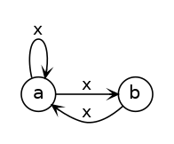
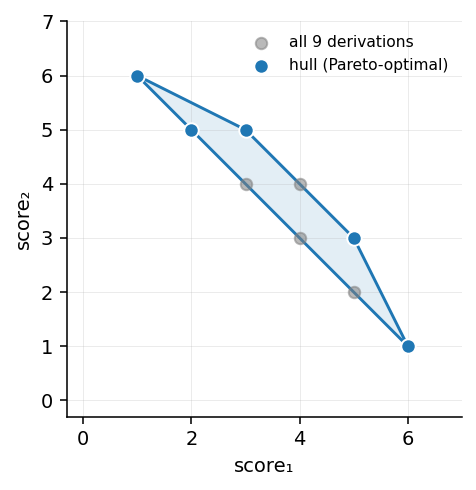

# Semirings

[](https://github.com/timvieira/semirings/actions/workflows/ci.yml)
[](https://codecov.io/gh/timvieira/semirings)

A Python library of semirings for dynamic programming.

Semirings are a powerful abstraction that enable a clean separation of concerns:

1. Devise a compact encoding of a set of derivations (e.g., paths in a graph,
   parses of a sentence).
2. Choose how to evaluate and aggregate them (e.g., the highest-weight
   derivation, the total weight, the set of all paths as a regular language).

By swapping the semiring, the *same* algorithm computes something entirely
different—and this library gives you a rich collection of semirings to swap
in.

## Installation

```bash
pip install git+https://github.com/timvieira/semirings
```

## Example: One Algorithm, Many Answers

Here is a tiny weighted graph — two nodes, three edges, a self-loop on `a` and
a cycle `a ⇄ b`:



There are infinitely many walks from `a` back to `a`: the empty walk, the
self-loop, the detour through `b`, and arbitrary combinations. `WeightedGraph`
is itself a semiring (edgewise sum, relation composition, Kleene star), so
`g.star()` sums over all of them in whatever algebra you chose. Swap the
`WeightType` and the *question* changes.

### Symbolic: the Fibonacci generating function falls out

Lift every edge weight to a SymPy symbol and Kleene returns a closed-form
rational function. Taylor-expand it and the Fibonacci numbers are the
coefficients:

```python
from semirings import Symbolic, WeightedGraph
from sympy import Symbol, simplify, series

x = Symbol('x')
g = WeightedGraph(Symbolic)
g['a', 'a'] = x
g['a', 'b'] = x
g['b', 'a'] = x

f = g.star()['a', 'a']
print(simplify(f))
# -1.0/(x**2 + x - 1)           i.e.  1 / (1 - x - x²)

print(series(f, x, 0, 10).removeO())
# 1 + x + 2·x² + 3·x³ + 5·x⁴ + 8·x⁵ + 13·x⁶ + 21·x⁷ + 34·x⁸ + 55·x⁹
```

The coefficient of `xⁿ` is the number of length-`n` walks from `a` back to
`a`, and those counts are Fibonacci.

### Float: total weight of infinitely many walks

```python
from semirings import Float, WeightedGraph
g = WeightedGraph(Float)
g['a', 'a'] = 0.3;  g['a', 'b'] = 0.3;  g['b', 'a'] = 0.3
print(g.star()['a', 'a'])
# 1.6393442622950823           i.e. 1 / (1 - 0.3 - 0.09)
```

### MinPlus: shortest path

```python
from semirings import MinPlus, WeightedGraph
g = WeightedGraph(MinPlus)
for e in [('a','a'), ('a','b'), ('b','a')]:
    g[e] = MinPlus(1.0)
print(g.star()['a', 'b'])
# MinPlus(1.0, ...)             — take a → b directly
```

### ShortLex: enumerate walks shortest-first, on demand

```python
from semirings import WeightedGraph, ShortLex
from arsenal.iterextras import take

g = WeightedGraph(ShortLex)
g['a', 'a'] = ShortLex('A', 'A')
g['a', 'b'] = ShortLex('B', 'B'); g['b', 'a'] = ShortLex('C', 'C')

for p in take(8, g.star()['a', 'a']):
    print(repr(p.score))
# '', 'A', 'AA', 'BC', 'AAA', 'ABC', 'BCA', 'AAAA'
# grouped by length:  0 | 1 | 2 (×2) | 3 (×3) | 4 ...  — Fibonacci again
```

The returned stream is a lazy sorted merge, so this works even though the set
of walks is infinite.

Same graph, same call, four different answers — one of them a closed-form
generating function, one a live enumerator over an infinite support.

## Example: Pareto-optimal Derivations with ConvexHull

Give every rule two competing scores — fluency vs. brevity, quality vs. cost,
whatever. Exponentially many combined derivations exist, but only the
*Pareto-optimal* ones matter: a derivation is relevant iff it maximizes some
linear combination of the two scores. The `ConvexHull` semiring (Dyer, 2013)
computes exactly that set, composing hulls instead of enumerating derivations.

```python
from semirings import ConvexHull, Point

# Two decision steps, three options each, scored (s₁, s₂).
step1 = ConvexHull([Point(1, 4), Point(3, 3), Point(4, 1)])
step2 = ConvexHull([Point(0, 2), Point(2, 0), Point(1, 1)])

# Sum over the 3×3 combined derivations is Minkowski addition of the hulls.
result = step1 * step2
print(sum(1 for _ in result))    # 5 hull vertices, not 9 raw combinations
```



Grey dots are all 9 combined `(s₁, s₂)` pairs. The blue polygon is the hull
that `step1 * step2` returns. Everything inside the hull is dominated by some
convex combination of the vertices, so the DP throws those points away. Chain
K steps with N options each, and only the extreme points survive at every
step — the work stays linear in the hull size, never exponential in K.

`ConvexHull.star()` is intentionally not defined: nontrivial hulls blow up
under star (the Minkowski-sum iteration grows without bound). Use it on DAGs.

## Semiring Compendium

### Optimization

- **`MinPlus`** (tropical): `+` is min, `*` is addition. Shortest path / cheapest
  derivation.

- **`MaxPlus`** (arctic): `+` is max, `*` is addition. Longest path /
  highest-weight derivation.

- **`MaxTimes`** (Viterbi): `+` is max, `*` is multiplication. Most probable
  explanation in a probabilistic model.  Augment with backpointers to recover
  argmax.

- **`MinTimes`**: `+` is min, `*` is multiplication. Least probable derivation.

- **Bottleneck** (`semirings.misc`): `+` is max, `*` is min. Maximum-capacity
  path in a network.

- **`LazySort`** (K-best): Lazily enumerates the K-best derivations in sorted
  order without fixing K in advance. Uses lazy sorted merge and sorted product
  over streams. Default is max-times (Viterbi K-best); build variants with
  `make_lazysort_semiring(name, base_times, base_one, base_lt)`.

- **`ShortLex`**: `LazySort` variant where derivations are strings, ordered
  shortest-first with lexicographic tiebreaks. Concatenates with `+`.
  Enumerates walks, parses, or any sequence-valued derivation in reading order.

- **`ConvexHull`** (MERT): `+` is convex hull union, `*` is Minkowski sum.
  Finds the set of optimal derivations under all linear weightings of
  objectives—used in minimum error rate training for machine translation.

### Arithmetic & Probabilities

- **`Float`**: Ordinary real arithmetic. Counts paths, computes total weight.
  Kleene star is `1/(1-x)`.

- **`LogVal`**: Numerically stable log-space arithmetic—isomorphic to the
  nonnegative reals, but avoids underflow by storing log-magnitudes and sign
  bits. Indispensable for probabilistic models.

- **Dual numbers** (`semirings.misc`): Forward-mode automatic differentiation.
  Computes function value and derivative simultaneously.

### Logic

- **`Boolean`**: `+` is OR, `*` is AND. Tests reachability and provability.

- **Lukasiewicz** (`semirings.misc`): `+` is max, `*` is max(0, x+y-1). A
  semiring for fuzzy / many-valued logic.

- **Three-valued logic** (`semirings.misc`): Values are {true, false, unknown}.
  `+` is max, `*` is min. Useful when some facts are uncertain.

### Provenance

Provenance semirings track *why* a query result holds in a database.

- **Why** (`semirings.misc`): Values are sets of annotation products. Captures
  which combinations of base facts are needed for a derived fact.

- **Lineage** (`semirings.misc`): Values are sets of reachable annotations—tracks which base facts contribute, without distinguishing how they combine.

### Formal Languages

- **`Symbol`** (regular languages): `+` is regex union, `*` is concatenation.
  Values are regular expressions / finite-state automata. The semiring of
  formal languages can enumerate the set of strings accepted by a grammar or
  automaton.

### Graph Structure

- **Bridge / VBridge** (`semirings.misc`): Detects edge bridges and vertex
  bridges (articulation points) in graphs via semiring computation.

- **`CutSets`**: `+` is set union, `*` is set intersection over minimal sets.
  Enumerates cut sets in a graph.

### Matrices

- **`MatrixSemiring(S, domain)`** (`semirings.kleene`): Given any semiring `S`
  and a finite domain, constructs the semiring of square matrices over `S`.
  Addition is element-wise, multiplication is matrix product, and Kleene star is
  computed via Kleene's algorithm. The domain can be any collection of hashable
  elements (strings, integers, etc.).

### Other

- **`Interval`**: Interval arithmetic (note: sub-distributive, so not a true
  semiring, but useful in practice).

- **Division** (`semirings.misc`): `+` is GCD, `*` is LCM.

- **String** (`semirings.misc`): `+` is longest common prefix, `*` is
  concatenation.

## More Examples

```python
from semirings import LogVal, Float

# LogVal: numerically stable log-space arithmetic
x = LogVal.lift(0.001)
y = LogVal.lift(0.002)
print(float(x + y))      # 0.003, computed stably in log-space

# Kleene star: the infinite sum 1 + x + x^2 + x^3 + ...
x = Float(0.5)
print(x.star())           # Float(2.0), i.e., 1/(1-0.5)
```

## Core API

Every semiring subclasses `Semiring` and provides:

```python
S.zero            # additive identity
S.one             # multiplicative identity
S.lift(x)         # lift a raw value into the semiring
x + y             # semiring addition
x * y             # semiring multiplication
x ** n            # exponentiation by squaring
x.star()          # Kleene star: 1 + x + x^2 + x^3 + ...
S.sum(xs)         # fold addition over an iterable
S.product(xs)     # fold multiplication over an iterable
S.chart()         # create a Chart (defaultdict with zero default)
```

Custom semirings can be constructed on the fly:

```python
from semirings import make_semiring

Tropical = make_semiring(
    name  = 'Tropical',
    plus  = min,
    times = lambda a, b: a + b,
    zero  = float('inf'),
    one   = 0,
)
```

## References

For a comprehensive overview of semirings and their applications in dynamic
programming, see the Semiring Compendium in chapter 3.3 of:

> [Automating the Analysis and Improvement of Dynamic Programming Algorithms
> with Applications to Natural Language
> Processing](http://timvieira.github.io/doc/2023-timv-dissertation.pdf).
> Tim Vieira. PhD Dissertation, Johns Hopkins University. 2023.
